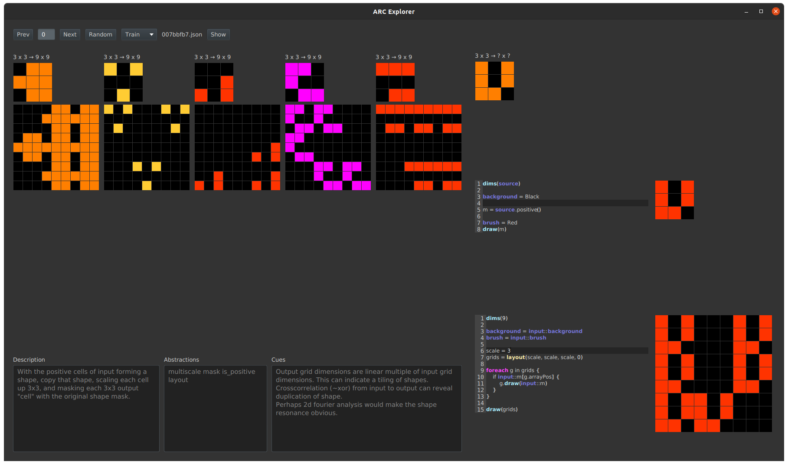
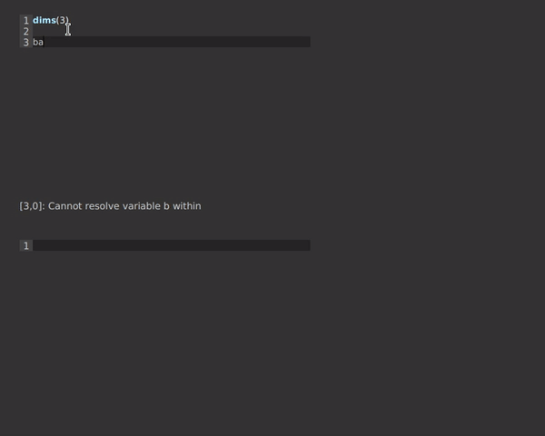

ARC Solver
===

This project is the results of my attempt to solve the [ARC challenge](https://www.kaggle.com/c/abstraction-and-reasoning-challenge).

### Background

The problems are psychometric-style puzzles that are very tricky for computers to solve. 
The best known methods employ a search over short programs. 

In my approach, I built a domain-specific language (DSL) to generate the results for these puzzles.
Also, I built an IDE to rapidly iterate on pieces of code written in this language to see if they solved the puzzle. 

### Media

A screenshot of the IDE

Here's a video of code interpretation part of the  IDE in action:

 
### Notable classes

#####viz.Previewer

This is the integrated environment that displays the problem examples, note-taking text areas,  

##### gen.dsl.arc.Visitor

This class does the heavy lifting of interpreting the ARC dsl language. 

##### gen.grid.Mask

This is the graphical backbone of the DSL. All shapes are Masks, and this class provides many utilities for 
working logically with masks.

For example: `mask.left()` returns a mask of all the cells to the left of the positive cells in `mask`. 
You can chain any prepositional functions, like `mask.above().left().around()`, which will give you a new mask.
  